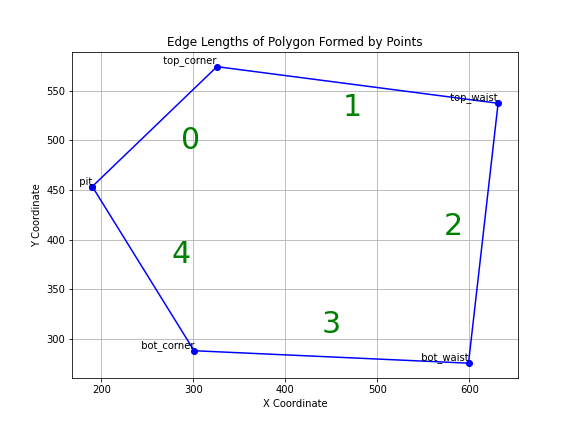

# Welcome to the image and path processing toolkit

#### The code is split into two sections `video_process.py` and `path_cleaning.py`. These are very similar tools but have some important differences.

## Config Files

Both the video_process and path_cleaning expect a config file to be passed to manage the filtering. These config files specify how the pipeline functions, what input is used, and all other important tunable features of the process. If a value is defined in both the config file and command line arguments it defaults to command line arguements. This is useful if you have a config file whos results you are happy with but would like to try on a different image set without changing the file. In both files the pipeline is customized but before the pipeline is run all images / videos / tracking results are read into memory. Then after the pipeline is run a video will be created based on the output name, you do not need to explicitly add that as a stage.

#### Example config file for video_process

```
# File Paths
image_folder: [PATH TO IMAGES]
flat_folder: [PATH TO FLATS]
output_name: "mean_demo"

# Video Settings
## what frame to begin processing on
vid_start_index: 1000

## number of images to read in. Important note is that this does not account for stride. a num_images of 400 and stride of 2 will result in a 200 frame video
num_images: 400

## stride to use when looking at images.
video_stride: 2

## useful if your videos are RGB but need to be grayscale
convert_to_gray: False

## this crops the input videos to reduce memory usage and make it easier to view
crop: [
  [500,-1],
  [800,-1]
]

# Pipeline Stages
## This is how the pipeline is created in both methods. This should be a list of stages each one an object with a name and any required parameters. For details on methods look below.
pipeline:
  [
    {
      # Name of method. This needs to match exactly the name of the method
      name: mean_divide_video,
      # Any positional arguments (for example blur takes a argument for the size of the blur kernel)
      params:
        [10],
      # keyword arguments. for example the fourier_masker_center method takes a number of named inputs
      kwargs: {}
    },
    {
      name: std_normalize,
      params: [3],
      kwargs: {}
    },
    {
      name: normalize,
      params: [255],
      kwargs: {}
    },
  ]

```

#### Example config file for path_cleaning

```
# File Paths
base_video_folder: [PATH TO FOLDER OF VIDEOS]
output_name: "simple_kalman.mp4"

# this is how you can define the ideal shape for your videos, these must be in clockwise order and the same order as the points below.
ideal_pts: [[190, 453],
       [325, 574],
       [631, 537],
       [599, 275],
       [300, 288]]

# These are the point names you want to read in from the tracking results. These names must exactly match the names of each point used in DeepLabCut.
points : [
    "pit",
    "top_corner",
    "top_waist",
    "bot_waist",
    "bot_corner",
]

# Pipeline Stages
## The overall pipeline works the same as for video_process but each method is different.
pipeline:
  [
    {
      # Name of method
      name: jump_filter,
      # Any positional arguments (for example blur takes a argument for the size of the blur kernel)
      params:
        [2000],
      # keyword arguments
      kwargs: {},
      # method used to link filtered out regions options [lerp, spline]. Some methods require this as their purpose is only to find regions requiring a fix. If none is provided it will default to "lerp". More details on linkers below.
      linker: "lerp"
    },
    {
      name: from_fixed_filter,
      params: [675, 525, [800, 350]],
      kwargs: {},
      targets: ["pit"],
      linker: "lerp",
    },
    {
      name: conf_filter,
      params: [0.9],
      kwargs: {},
      linker: "lerp",
    },
    {
        # some methods do not require a linker, refer to notes below to know which methods do and do not require a linker. There is no harm in specifying a linker when none are required.
      name: kalman_filter_2d,
      params: [1000, 10],
      kwargs: {},
    },
    {
      name: shape_filter,
      params: [0.00001, 0.1],
      kwargs: {
          "base_pt": [
              [190.2, 453.5],
              [325.7, 574.2],
              [631.2, 537.4],
              [599.0, 275.5],
              [300.8, 288.1]]
      },
    },
  ]

```


---
## Video Process

##### Command line args:

- config (-c)
    - path to config file, more details on config files below
- input (-i)
    - path to folder containing input images
- output(-o)
    - path to store processed videos 
- flat (-f)
    - path to flat images (if they are used). As a note they are not required for most pipelines as the mean divide server the same purpose.
- no_flat (-nf)
    - flag to pass when not using a flat image
- begin (-b)
    - frame number to begin processing. Useful if you have a long series of images and want a subset or have garbage data at the beginning of the sequence.
- num_images (-n)
    - number of images to read in from disk
- stride (-s)
    - stride of images used in processing, often times a stride of 2 helps amplify motion and improve filter quality.
- crop (-cr)
    - pixel values for cropping input images. helpful if images are large but only a small region is important. Also very helpful for limiting memory usage to allow longer sequences.
- recursive (-r)
    - add this flag for the pipeline to be run on all subfolders of input (for instance if you have multiple videos to run at once).

### Image and Video Processing Functions

#### Video Functions

1. **process_video(vid, func, args, kwargs)**: 
   - Applies a specified function to each frame of the video.
   - Useful for batch processing of video frames with custom image processing functions.

2. **write_video(vid, name, folder="videos")**:
   - Writes a video file from an array of frames.
   - Useful for saving processed videos.

#### Image Functions

1. **cv_denoise(img, strength=2)**:
   - Applies OpenCV's fastNlMeansDenoising to an image.
   - Reduces noise in images.

2. **sobel_2d(img)**:
   - Computes the Sobel gradient of an image.
   - Useful for edge detection.

3. **cv_sobel(img, axis=0)**:
   - Applies a Sobel filter using OpenCV along a specified axis.
   - For detecting horizontal or vertical edges.

4. **blur(img, size=3)**:
   - Applies Gaussian blur to an image.
   - Useful for smoothing images.

5. **sharpen(img, size=3)**:
   - Sharpens an image using a Gaussian filter.
   - Enhances details in images.

6. **median_filter(img, size=3)**:
   - Applies a median filter.
   - Effective for removing salt-and-pepper noise.

7. **detect_edge(img, image_mul=1)**:
   - Detects edges in an image using PIL's FIND_EDGES filter.
   - Useful for highlighting edges.
   - image_mul scaled the entire image, useful if the images values are too low for the filter to detect.

8. **threshold_img(img, threshold=[0.1,0.8])**:
   - Applies a binary threshold to an image.
   - Useful for isolating elements based on intensity.

9. **modify_contrast(img, factor=1.5, img_mul=100)**:
   - Adjusts the contrast of an image.
   - Enhances the visual appearance or highlights features.

10. **get_hog(img, orientations=9, pixels_per_cell=(8,8), cells_per_block=(2,2))**:
    - Computes Histogram of Oriented Gradients (HOG) for an image.
    - Useful for feature extraction in image analysis.
    - for more information: https://scikit-image.org/docs/stable/auto_examples/features_detection/plot_hog.html

11. **fourier_masker_low(image, i, show=False)**:
    - Applies a low-pass Fourier filter to an image.
    - Useful for removing high-frequency noise.

12. **fourier_masker_vert(image, i, show=False)**:
    - Applies a vertical Fourier mask.
    - Useful for isolating or removing vertical frequencies.

13. **fourier_masker_hor(image, i, show=False)**:
    - Applies a horizontal Fourier mask.
    - Useful for isolating or removing horizontal frequencies.

14. **fourier_masker_center(image, size=5, i=1, show=False)**:
    - Applies a center mask in the Fourier domain.
    - Can be used to remove or isolate central frequencies.
    - `i` is to provide a value to mask with

15. **laplacian(vid)**:
    - Applies a Laplacian filter to a video.
    - Enhances edges in video frames.

16. **mean_divide_video(vid, n_frames)**:
    - Divides each frame of the video by the mean of a number of surrounding frames.
    - Useful for normalizing brightness variations.

17. **mean_divide_video_bidir(vid, n_frames_f, n_frames_b)**:
    - Applies bidirectional mean division on video frames.
    - Helps in correcting illumination differences.
    - Very similar to mean divide method but gathers the mean from before and after the given frame

18. **mix_videos(vid_a, vid_b, mix_coef)**:
    - Mixes two videos based on a mixing coefficient.
    - Useful for combining features or effects from two different videos.

19. **temporal_bilateral_filter(vid)**:
    - Applies a bilateral filter temporally across video frames.
    - Effective in noise reduction while preserving edges.

#### Utility Functions

1. **norm_vid(images)**:
   - Normalizes video frames.
   - Ensures uniform brightness and contrast across frames.

2. **frame_norm(vid)**:
   - Normalizes each frame of a video independently.
   - Useful for correcting variations within each frame.

3. **std_normalize(vid, stds=1)**:
   - Normalizes a video based on standard deviation.
   - Balances the brightness and contrast based on statistical measures.

4. **normalize(vid, max_val=1)**:
   - Normalizes a video to a specified maximum value.
   - Ensures a consistent scale across video frames.

5. **mul(vid, coef)**:
   - Multiplies each frame of the video by a coefficient.
   - Useful for adjusting the intensity or brightness
  
---

## Image and Video Processing Functions for Motion Analysis and Tracking

##### Command line args:

- config (-c)
    - path to config file, more details on config files above
- input (-i)
    - path to folder containing input videos
- output(-o)
    - path to store processed video

### Tracking and Filtering Functions

#### Pure Filters

1. **KalmanFilter2D** (Class):
   - Implements a 2D Kalman filter for smoothing and prediction in tracking.
   - Handles noise in motion tracking data.
   - should be used through the `kalman_filter_2d` method and not directly instantiated.

2. **kalman_filter_2d(data, a=1000, b=10)**:
   - Applies 2D Kalman filtering to a set of tracks.
   - Enhances track smoothness and predicts future positions.
   - a and b are coefficients that control the behavior of the filter, you should try adjusting them to see the results.
       - these values can range from 1000 to 0.0001, sometimes extremely small values are required. 

#### Validity Checks

These methods return a boolean list with the shape `[n_points_being_tracked, f_frames_in_track]` with False for any frames that are invalid. These boolean masks are passed to `get_fix_regions` to get upper and lower bounds on each region that requires fixing. Finally to fill in these invalid regions a linker is required. There are 2 linkers provided which are explained below. 

1. **jump_filter(all_tracks, threshold=5)**:
   - Identifies jumps or abrupt changes in tracks based on a threshold.
   - Useful for detecting anomalies in movement.

2. **jump_filter_sophistic(all_tracks, threshold=5)**:
   - A sophisticated version of jump filtering with adjustable parameters.
   - Helps in refining the detection of movement jumps.

3. **from_fixed_filter(track, dmax, dmin, center)**:
   - Filters track points based on their distance from a fixed point.
   - Useful for focusing on movements within a specific range.

4. **conf_filter(track, conf_threshold=0.9)**:
   - Filters track points based on a confidence threshold.
   - Ensures only high-confidence points are considered.

#### Region Linking

these methods take sets of invalid regions, defined as a list tuples where each tuple is an invalid regions starting and ending frame index. These linkers then fill in the invalid regions with assumed data based on valid points on either side.

1. **link_regions_spline(track, lost_regions, search_size=4)**:
   - Links missing regions in a track using cubic Hermite spline interpolation.
   - Useful for reconstructing lost or occluded parts of a track.
   - This can result in better smooth motion going into and out of the lost region but also can result in more innacuracy if the velocity is difficult to measure.

2. **link_regions_lerp(tracks, regions, search_size=4, max=None)**:
   - Performs linear interpolation to connect separated regions in tracks.
   - Helps in bridging gaps in tracking data.

#### Shape Matching Methods

The shape match method allows for weighting the edges to allow for more deviation in certain axis than others. For the basic example this is how the distances are calculated, green numbers indicate the index of this edge in the distance list.



Then to specify edge weights you must provide edge_weight in the config file as is shown in `kalman_with_shape.yaml`. The values in the edge_weights line up with the green numbers in this figure, so if you would like to allow the eye tube to contract you would want to shrink values `1` and `3`. An important note, the weights are normalized to not change the overall loss. As in if you were to set the weights to `[2, 2, 2, 2, 2]` it would not double the strength of the shape matching. The values are only important relative to each other. 

1. **calculate_angles(reference_points)**:
   - Calculates angles formed by triplets of points in a set of reference points.
   - Useful for getting a ground truth shape (done automatically)

2. **shape_objective_function(x, expected_distances, expected_angles, dist_coef=1, angle_coef=1)**:
   - An objective function for shape optimization, focusing on distances and angles.
   - Used in optimizing the shape of tracks based on expected geometrical properties.
   - This method can be replaced or changed to affect how the shape matching behaves

3. **optimize_frame(frame_points, expected_distances, expected_angles, coefs)**:
   - Optimizes the shape of a single frame's points based on expected distances and angles.
   - This method is handled by `shape_filter` but for context this is what actually optimizes a frame based on shape

4. **shape_filter(path, dist_coef=1, angle_coef=1, base_pt=None)**:
   - Filters and optimizes the shape of an entire path of tracked points.
   - Ensures the path adheres to expected geometrical constraints.
   - this method matches the shape of 5 points in each frame to a `base_pt` which is a list of 2D pixel coordinates of your shape in clockwise order.

#### Video Processing Functions

1. **make_video_set(videos, tracks, name="video.mp4")**:
   - Creates a video from a set of tracks, overlaying the tracking data on the original video frames.
   - Useful for visualizing and analyzing tracked movements in videos.
   - videos should be a list of video paths
   - tracks should be a list of 2D tracks

#### Utility Functions

1. **get_fix_regions(masks, min_size=5)**:
   - Identifies regions in a mask that need fixing based on a minimum size criterion.
   - Helps in pinpointing areas in tracks that require interpolation or reconstruction.

2. **get_deltas(track)**:
   - Calculates the difference between consecutive points in a track.
   - Useful for motion analysis and understanding directional changes.
